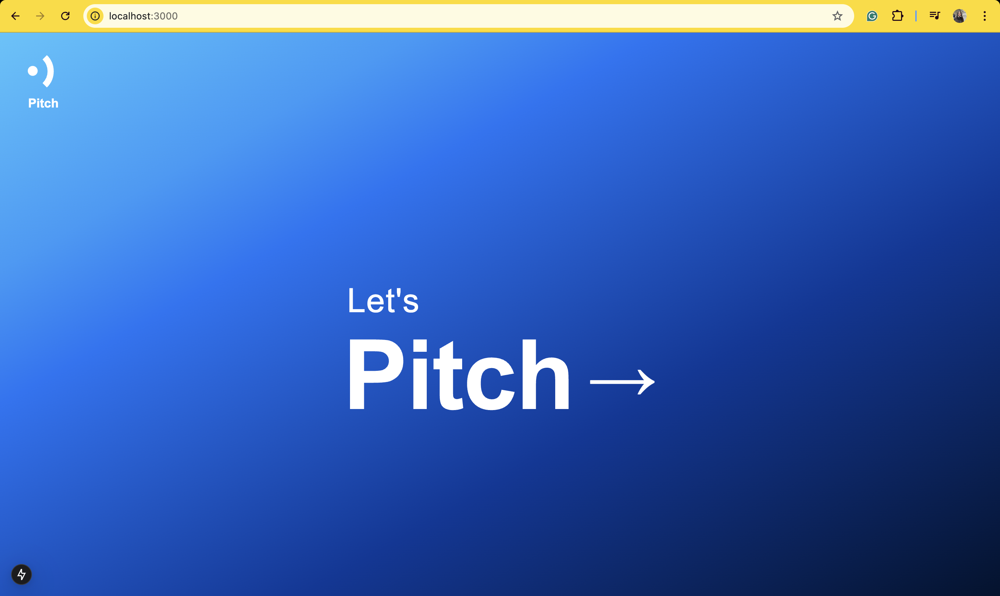
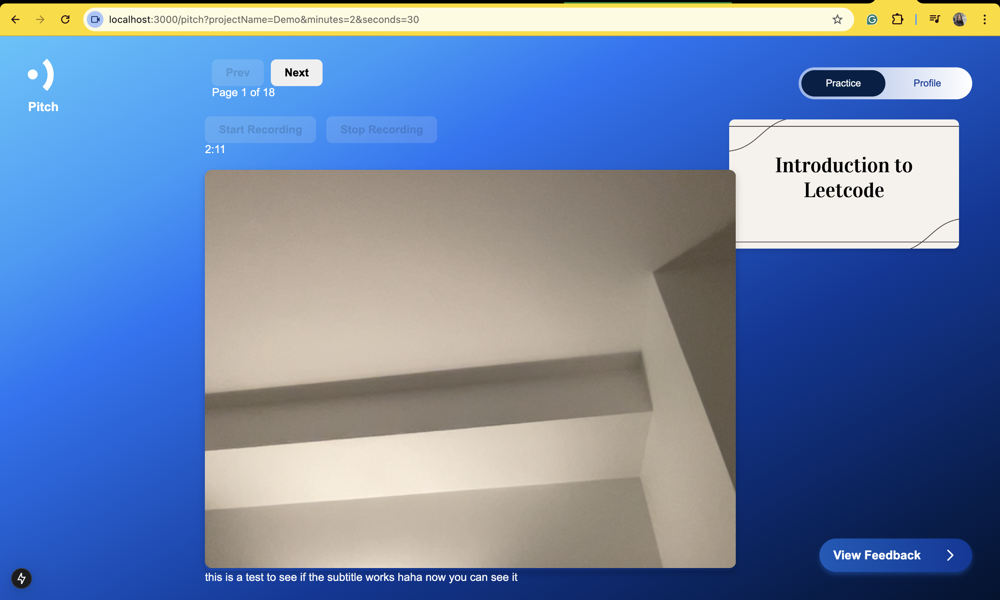
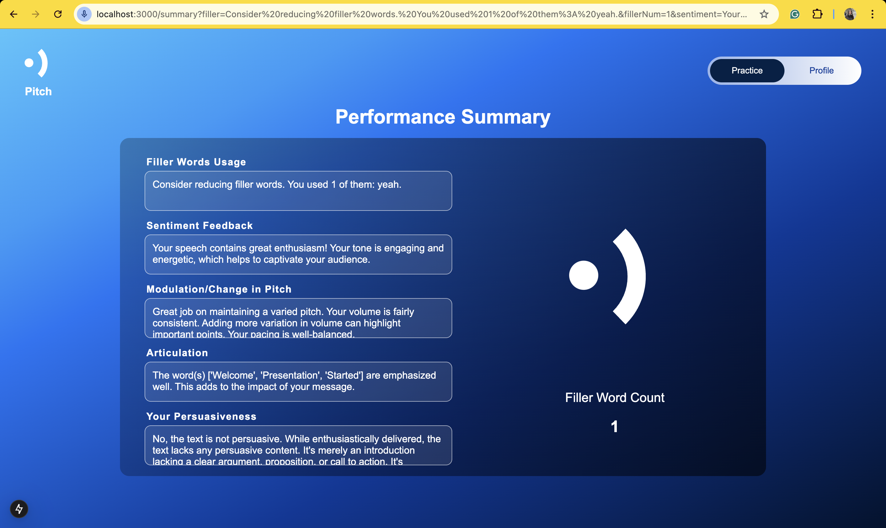
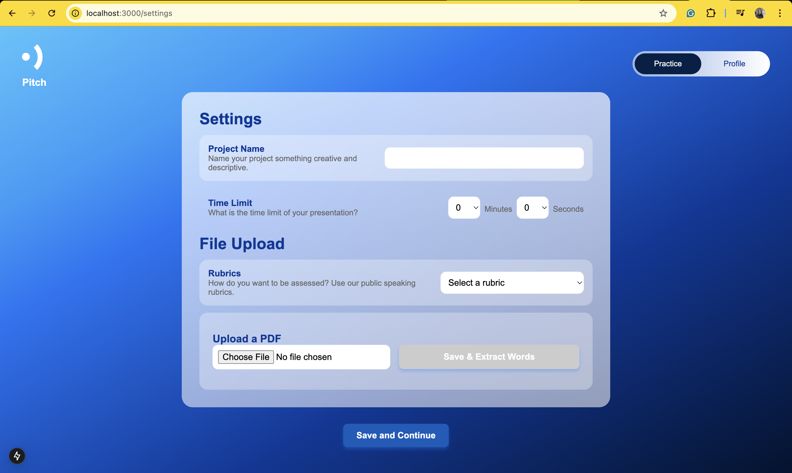

# Pitch It Perfect: ConUHacks 2025

Pitch It Perfect is a web application designed to help users enhance their presentation and pitching skills. The platform allows users to record their presentations and receive personalized feedback on over 8 different criteria. By leveraging traditional NLP approaches, pretrained language models, and cutting-edge AI, Pitch It Perfect provides in-depth insights to improve clarity, delivery, engagement, and overall effectiveness.

## Features
- **Record Presentations**: Easily capture your presentation directly from the web app with real-time subtitle.

- **AI-Powered Feedback**: Get detailed feedback on 8+ key criteria including clarity, tone, pacing, and confidence.

- **User-Friendly Interface**: Simple and intuitive design for seamless experience.

- **Multiple AI Models**: Utilizes a mix of traditional NLP techniques, pretrained language models, and the latest AI advancements.
- **Continuous Improvement**: Track progress over time with detailed analytics.

## Usage Guide
1. **Set up Project**: Set up project criteria, grading rubrics, time limit, and upload your presentation.
2. **Record Your Presentation**: Use your device's microphone and camera to record your pitch.
3. **Submit for Analysis**: The AI will evaluate your performance based on multiple factors.
4. **Receive Feedback**: Get actionable insights and recommendations for improvement.
5. **Refine & Repeat**: Practice, apply feedback, and track progress over multiple attempts.

## Contributors
- **Sataphon (PF) Obra**: PhD in Framework knowledge and debugging
- **Phonlakrit (MP) Tiraratn**: UX-UI Design Expert Veteran
- **Yi-an (Kimi) Chu**: The real CSS God
- **Lapatrada (Claire) Jaroonjetjumnong**: Resident Backend Enjoyer

## License
This repository has a Creative Commons CC0-1.0 license.

